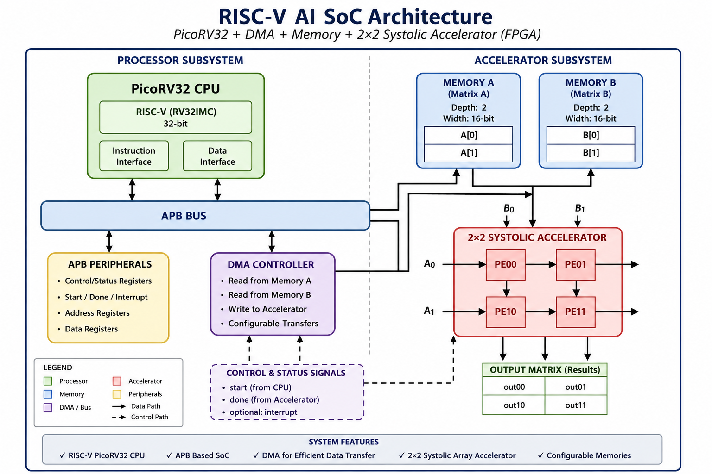
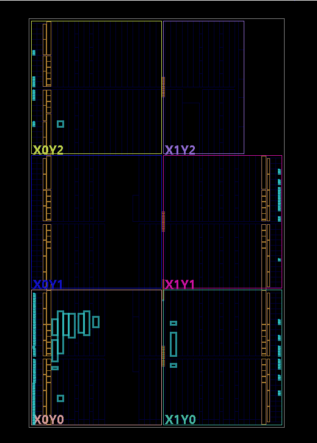
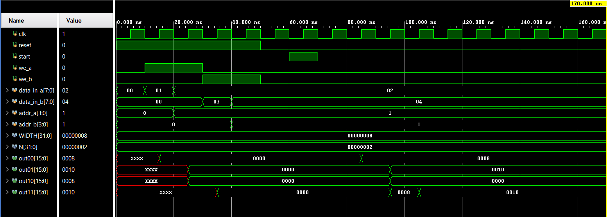
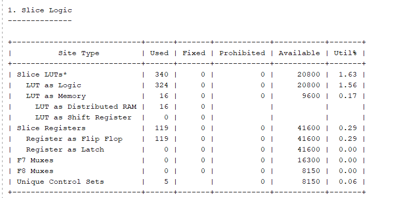
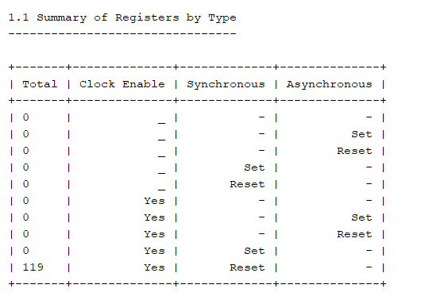
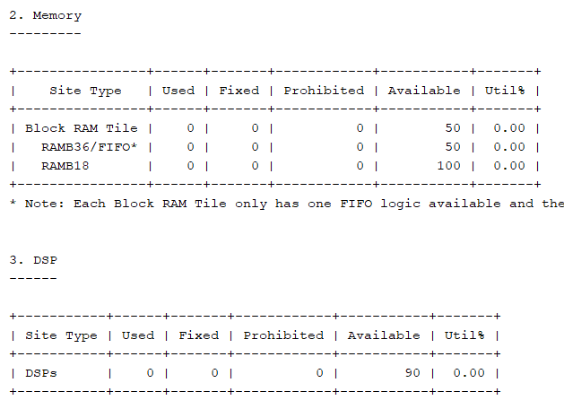

# RISC-V AI Accelerator SoC on FPGA

## Overview

This project implements a custom FPGA-based System-on-Chip (SoC) integrating a PicoRV32 RISC-V processor, DMA controller, memory subsystem, APB-based accelerator interface, and a parameterizable N×N systolic-array AI accelerator.

The design is developed in Verilog HDL and implemented using Xilinx Vivado. The objective is to explore SoC design concepts while demonstrating hardware acceleration for matrix computations through a scalable systolic-array architecture.

The project successfully completed RTL simulation, synthesis, implementation, and FPGA bitstream generation.

---

## Architecture



### Main Components

- PicoRV32 RISC-V Processor
- DMA Controller
- APB Accelerator Interface
- Memory A (Matrix A Storage)
- Memory B (Matrix B Storage)
- Parameterizable N×N Systolic Array Accelerator
- SoC Top Module

### Data Flow

```text
Memory A/B
    ↓
DMA Controller
    ↓
N×N Systolic Accelerator
    ↓
Output Matrix
```

## Features

- FPGA-based AI Accelerator SoC
- PicoRV32 RISC-V Processor Integration
- DMA-Assisted Data Movement
- APB-Based Accelerator Interface
- Parameterizable N×N Systolic Array Architecture
- Verilog RTL Design
- Functional Simulation
- FPGA Synthesis and Implementation
- Bitstream Generation

---

## Project Structure

```text
rtl/
├── accelerator/
│   ├── pe.v
│   ├── systolic_nxn.v
│   └── accelerator_wrapper.v
│
├── bus/
│   ├── accelerator_interface.v
│   └── apb_accelerator_interface.v
│
├── cpu/
│   └── picorv32.v
│
├── dma/
│   └── dma_controller.v
│
├── memory/
│   └── memory_block.v
│
├── uart/
│
└── top/
    └── soc_top.v

tb/
└── tb_soc_top.v

docs/
├── architecture_diagram.png
├── waveform.png
├── floorplan.png
└── resource_utilization.png
```

## Tools Used

* Verilog HDL
* Xilinx Vivado
* PicoRV32
* FPGA Design Flow


## Verification Flow

1. RTL Simulation
2. Functional Verification
3. Synthesis
4. Implementation
5. Bitstream Generation


## FPGA Floorplan




## Results



* Simulation completed successfully
* Synthesis completed successfully
* FPGA implementation completed successfully
* Bitstream generated successfully


## Resource Utilization





Implementation Summary:

| Resource | Utilization |
|-----------|-------------|
| Slice LUTs | 340 (1.63%) |
| Registers | 119 (0.29%) |
| Block RAM | 0 |
| DSP Blocks | 0 |

The design occupies only a small fraction of the available FPGA resources, leaving significant headroom for future expansion and integration of additional peripherals and accelerator features.


## Future Work

* UART Communication
* Complete APB-Based Peripheral Access
* CPU-Controlled Accelerator Execution
* Interrupt Support
* Larger Systolic Arrays (4×4, 8×8)
* CNN Acceleration Support
